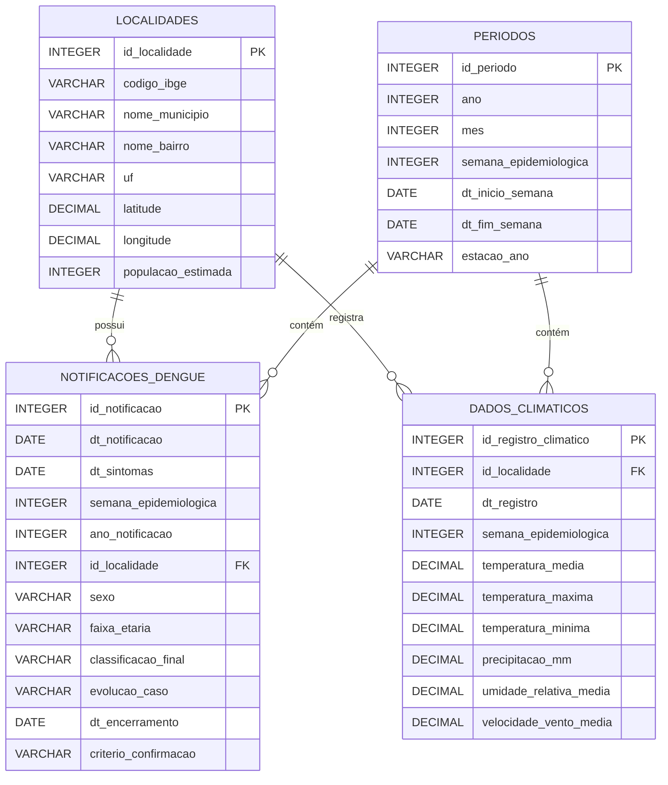

# Modelo Lógico — Versão 1

**Projeto:** Monitoramento e Prevenção de Focos de Dengue com Participação Cidadã  
**Data:** Junho/2026

---

## 1. Diagrama Entidade-Relacionamento (ER)

---

## 2. Descrição Tabular dos Relacionamentos

| Tabela Origem | Chave (PK/FK) | Tabela Destino | Cardinalidade | Descrição do Relacionamento |
|---|---|---|---|---|
| `localidades` | `id_localidade` (PK) | `notificacoes_dengue` | 1:N | Uma localidade pode ter muitas notificações de Dengue. Cada notificação pertence a exatamente uma localidade. |
| `localidades` | `id_localidade` (PK) | `dados_climaticos` | 1:N | Uma localidade pode ter muitos registros climáticos (um por dia). Cada registro climático é associado a uma localidade. |
| `periodos` | `semana_epidemiologica` + `ano` | `notificacoes_dengue` | 1:N | Um período (semana epidemiológica) contém várias notificações. As notificações são agrupadas por semana para análise temporal. |
| `periodos` | `semana_epidemiologica` + `ano` | `dados_climaticos` | 1:N | Um período contém vários registros climáticos. Os dados climáticos são agregados por semana para correlação com casos. |

---

## 3. Descrição das Tabelas

### 3.1 `notificacoes_dengue` (Tabela Fato)
- **Propósito:** Armazena cada caso notificado de Dengue, sendo a tabela central da análise.
- **Chave Primária:** `id_notificacao`
- **Chaves Estrangeiras:** `id_localidade` → `localidades.id_localidade`
- **Volume estimado:** ~10.000 a 500.000 registros (dependendo do recorte temporal e regional)
- **Granularidade:** Um registro por notificação individual (já anonimizada)

### 3.2 `localidades` (Tabela Dimensão)
- **Propósito:** Dimensão geográfica que permite agrupar notificações e dados climáticos por região, possibilitando a análise espacial (mapa de calor por bairro/município).
- **Chave Primária:** `id_localidade`
- **Volume estimado:** ~50 a 5.000 registros (municípios/bairros da região)
- **Granularidade:** Um registro por município ou bairro

### 3.3 `dados_climaticos` (Tabela Fato)
- **Propósito:** Dados diários de estações meteorológicas que serão cruzados com as notificações de Dengue para análise de correlação clima × incidência.
- **Chave Primária:** `id_registro_climatico`
- **Chaves Estrangeiras:** `id_localidade` → `localidades.id_localidade`
- **Volume estimado:** ~1.000 a 3.000 registros (dados diários de 2-3 anos)
- **Granularidade:** Um registro por dia por estação/localidade

### 3.4 `periodos` (Tabela Dimensão)
- **Propósito:** Dimensão temporal baseada em semanas epidemiológicas, usada para agrupar e correlacionar dados de notificação com dados climáticos na mesma janela temporal.
- **Chave Primária:** `id_periodo`
- **Volume estimado:** ~104 a 156 registros (52 semanas × 2 a 3 anos)
- **Granularidade:** Um registro por semana epidemiológica

---

## 4. Estratégia de Cruzamento de Dados

O cruzamento entre as bases do **SINAN** e do **INMET** será realizado por duas chaves:

1. **Chave geográfica:** `id_localidade` — associando notificações e dados climáticos à mesma região geográfica (município ou bairro mais próximo da estação meteorológica).

2. **Chave temporal:** `semana_epidemiologica` + `ano` — agrupando tanto os casos quanto os dados climáticos por semana epidemiológica, permitindo:
   - Análise de **correlação síncrona** (casos e clima na mesma semana)
   - Análise de **correlação com defasagem** (clima da semana N vs. casos da semana N+2, considerando o período de incubação do mosquito)

---

## 5. Observações

- O modelo segue o padrão **Star Schema** simplificado, com tabelas fato (`notificacoes_dengue`, `dados_climaticos`) e tabelas dimensão (`localidades`, `periodos`).
- A tabela `periodos` facilita a criação de filtros temporais no dashboard (por mês, estação, semana).
- As coordenadas geográficas em `localidades` permitem a criação de mapas de calor no dashboard.
