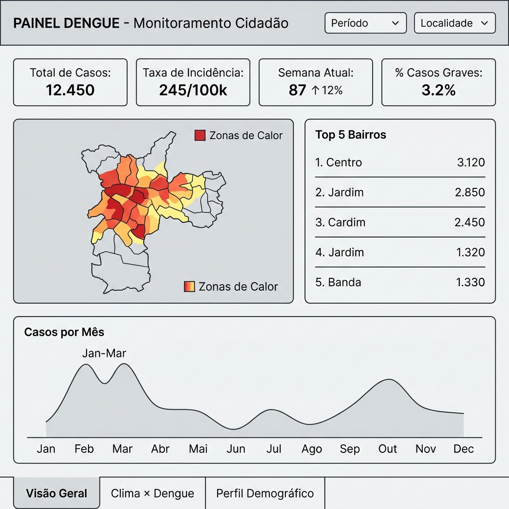
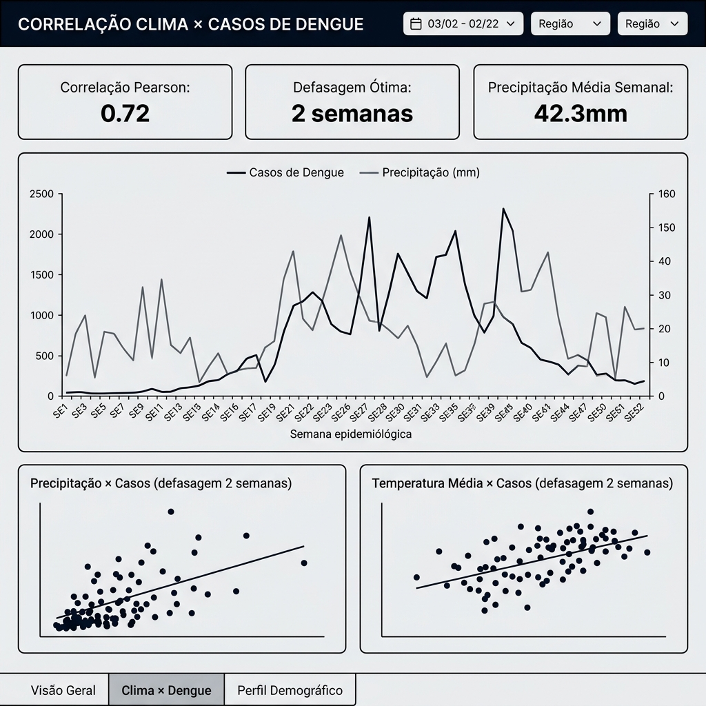
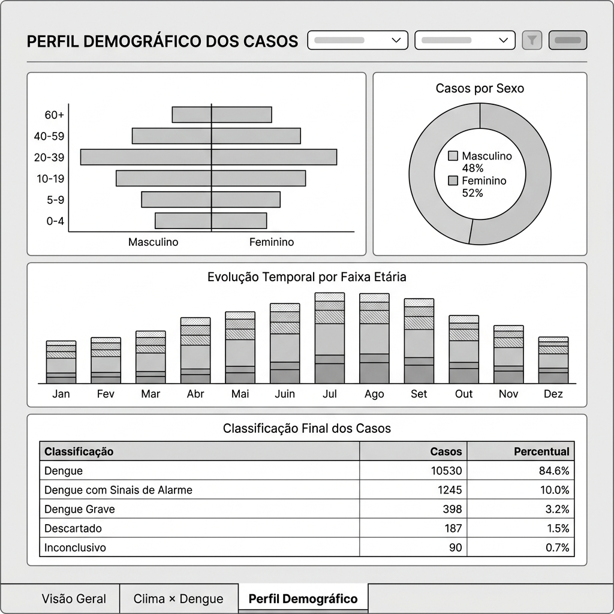
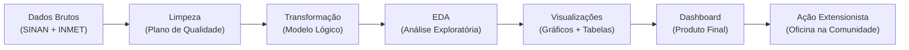

# Plano de Análise (EDA) e Produto Final

**Projeto:** Monitoramento e Prevenção de Focos de Dengue com Participação Cidadã  
**Data:** Junho/2026

---

## 1. Objetivo da Análise Exploratória (EDA)

Responder às **3 perguntas analíticas** definidas na AE1, identificar padrões sazonais e geográficos, e fornecer a base de dados para o dashboard interativo que será disponibilizado à comunidade.

---

## 2. Perguntas Analíticas e Insights Esperados

### Pergunta 1: Quais são os bairros/regiões que concentram o maior número de casos?

| Item | Detalhe |
|---|---|
| **Análise** | Distribuição geográfica das notificações de Dengue por localidade nos últimos 2-3 anos. |
| **Insight esperado** | Identificar os 10 bairros/municípios com maior incidência (taxa por 100 mil hab.), revelando "hotspots" para direcionar ações de prevenção. |
| **Gráficos/Tabelas** | ① Mapa de calor (heatmap geográfico) com intensidade por localidade. ② Gráfico de barras horizontais — Top 10 bairros por número absoluto de casos. ③ Tabela ranking — Localidade, nº de casos, população, taxa de incidência. |

### Pergunta 2: Existe correlação entre picos de precipitação/temperatura e aumento de casos?

| Item | Detalhe |
|---|---|
| **Análise** | Série temporal cruzando dados climáticos (precipitação e temperatura média semanal) com número de notificações por semana epidemiológica, incluindo análise com defasagem de 2-4 semanas. |
| **Insight esperado** | Confirmar se existe correlação positiva entre semanas chuvosas/quentes e aumento de casos nas semanas seguintes (considerando o ciclo de vida do mosquito de ~2 semanas). |
| **Gráficos/Tabelas** | ① Gráfico de linha dupla — Casos por semana epidemiológica × Precipitação semanal (com eixo Y secundário). ② Gráfico de dispersão (scatter) — Precipitação acumulada vs. Casos (com defasagem de 2 semanas). ③ Matriz de correlação — Correlação de Pearson/Spearman entre variáveis climáticas e nº de casos. |

### Pergunta 3: Qual é o perfil demográfico mais afetado?

| Item | Detalhe |
|---|---|
| **Análise** | Distribuição dos casos por sexo e faixa etária, identificando o grupo mais vulnerável para personalizar a linguagem da campanha de prevenção. |
| **Insight esperado** | Identificar se há faixa etária e sexo desproporcionalmente afetados (ex.: adultos 20-39 economicamente ativos que passam mais tempo fora de casa). |
| **Gráficos/Tabelas** | ① Pirâmide etária — Distribuição de casos por faixa etária e sexo. ② Gráfico de pizza/donut — Proporção de casos por sexo. ③ Gráfico de barras empilhadas — Evolução temporal dos casos por faixa etária. |

---

## 3. Análises Complementares

| Análise | Descrição | Gráfico |
|---|---|---|
| **Sazonalidade anual** | Comparar o padrão mensal de casos entre os anos analisados para identificar o "período crítico" | Gráfico de linha — Casos por mês, uma série por ano |
| **Classificação e gravidade** | Distribuição dos casos por classificação final (Dengue, Dengue com Sinais de Alarme, Dengue Grave) | Gráfico de barras empilhadas por mês |
| **Taxa de letalidade** | Evolução do caso (Cura vs. Óbito) por período | Indicador KPI (card numérico) |

---

## 4. KPIs do Dashboard

Com base nos indicadores definidos na AE1:

| KPI | Fórmula / Fonte | Visualização |
|---|---|---|
| **Total de Casos Notificados** | `COUNT(notificacoes_dengue)` no período selecionado | Card numérico grande |
| **Taxa de Incidência** | `(Total de casos / População) × 100.000` | Card numérico com indicador de tendência (↑/↓) |
| **Casos na Semana Atual** | Casos notificados na semana epidemiológica corrente | Card numérico com comparação à semana anterior (%) |
| **Top 5 Bairros** | Localidades com mais casos no período | Mini-ranking |
| **Correlação Clima × Casos** | Coeficiente de correlação (Spearman) entre precipitação e casos | Indicador numérico |
| **% Casos Graves** | `(Dengue Grave + Dengue com Sinais de Alarme) / Total × 100` | Card com barra de progresso |

---

## 5. Wireframe do Dashboard

O dashboard será organizado em **3 páginas** (telas), pensadas para serem acessíveis à comunidade:

### Página 1 — Visão Geral (Home)

**Elementos principais:**
- Barra de filtros: Período e Localidade
- 4 cards de KPIs: Total de Casos, Taxa de Incidência, Semana Atual, % Casos Graves
- Mapa de calor geográfico (casos por localidade)
- Ranking Top 5 Bairros
- Gráfico de linha: Casos por Mês (série temporal)

---

### Página 2 — Clima × Dengue (Correlação)

**Elementos principais:**
- 3 cards indicadores: Correlação de Pearson, Defasagem Ótima, Precipitação Média Semanal
- Gráfico de linha dupla: Precipitação × Casos por semana epidemiológica (eixo Y duplo)
- Scatter plot: Precipitação × Casos (com defasagem de 2 semanas)
- Scatter plot: Temperatura × Casos (com defasagem de 2 semanas)

---

### Página 3 — Perfil Demográfico

**Elementos principais:**
- Pirâmide etária: distribuição por faixa etária e sexo
- Gráfico donut: proporção de casos por sexo
- Barras empilhadas: evolução temporal por faixa etária
- Tabela: classificação final dos casos (Dengue, Dengue com Sinais de Alarme, Dengue Grave, etc.)

---

## 6. Ferramentas Previstas

| Etapa | Ferramenta | Justificativa |
|---|---|---|
| **EDA** | Python + Pandas + Matplotlib/Seaborn | Flexibilidade para análise e gráficos estatísticos. |
| **Dashboard** | Streamlit ou Looker Studio | Interatividade e acessibilidade para a comunidade (acesso via link). |
| **Mapas** | Folium (Python) ou recurso nativo do Looker | Visualização geográfica dos hotspots. |
| **Wireframe detalhado** | draw.io / Figma | Refinamento futuro do layout antes da implementação. |

---

## 7. Fluxo de Trabalho da Análise

